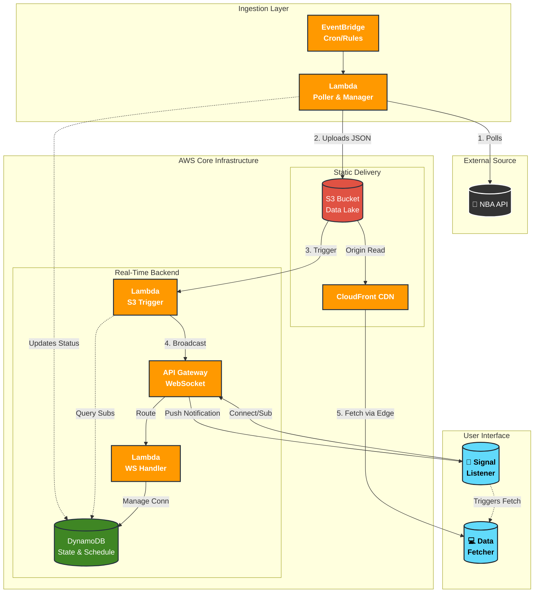

# [CourtVision](https://courtvision.roryeagan.com) 🏀
**Serverless Real-Time NBA Analytics & Play-by-Play Visualization**

   

[ **Launch Live App** ](https://courtvision.roryeagan.com)


## 📖 Introduction
**CourtVision** is a web dashboard for visualizing NBA games with high-density, interactive play-by-play views (beyond a standard scoreboard). I built it because I wanted a specific way to follow games live while watching, and I use it regularly.

The app runs on a **serverless AWS architecture** and uses a **hybrid push/pull real-time pattern**:
- WebSockets notify clients when new data is available.
- Clients then fetch the latest game data through **CloudFront → S3**, benefiting from CDN caching.

## ☁️ Architecture & Data Flow



### High-Level Components
- **Frontend:** React (Vite) static app served via **CloudFront** (origin: **S3**).
- **Game data storage:** JSON files in **S3**, served through **CloudFront**.
- **Real-time signaling:** **API Gateway WebSocket API** with **Lambda** handlers.
- **Connection/session state:** **DynamoDB** (stores connection IDs + current subscription info such as game/date).
- **Schedule metadata:** **DynamoDB** table for schedule basics; schedule payload is pushed via WebSockets.
- **Ingestion:** **AWS Lambda** (Poller) triggered by **EventBridge** (Cron/Rate) polls the NBA API and uploads new data to S3.

### 1) Client Subscription Model
Clients “subscribe” to a **game + date**:
- The WebSocket connection is established via API Gateway.
- The backend stores the connection/session in DynamoDB.
- When the user changes game/date, the subscription info updates so notifications can be targeted.

### 2) Data Update Flow (Hybrid Push/Pull)
1. **EventBridge** triggers the **Poller Lambda** during active games.
2. The Lambda fetches data from NBA endpoints, updates **DynamoDB** (scores/status), and uploads compressed JSON to **S3**.
3. **S3 event notification** triggers a **Lambda**.
4. Lambda queries **DynamoDB** (via a GSI keyed by `gameId`) to find connections currently subscribed to that game/date.
5. Lambda sends a **small WebSocket message** like “new data available.”
6. The browser fetches the updated JSON via **CloudFront → S3**.

### 3) Schedule Updates
- A DynamoDB table holds basic schedule metadata.
- A Lambda can send the full schedule payload to clients directly via WebSocket (useful for navigation without extra fetches).

## ⚡ Key Features

### 📊 High-Density Visualization
- **Interactive SVG charting** (pure SVG — no Canvas/D3 requirement).
- Hover/tooltip-style inspection of game events and game state.

### 🔌 Real-Time Updates
- WebSocket “data changed” notifications keep the UI feeling live.
- Data is fetched via CloudFront for caching efficiency.

### 🎨 UI/UX
- Dark-mode friendly layout.
- Designed for desktop-first analysis, usable on smaller screens.

## 📂 Repository Structure

The codebase is organized into three distinct logical units:

| Directory | Description |
| :--- | :--- |
| **`front/`** | **Frontend Client.** A Vite + React application. Contains the WebSocket connection manager, visualization components, and global state management logic. |
| **`functions/`** | **Serverless Backend.** AWS Lambda functions written in **Python**. Handles WebSocket lifecycle events, polls external NBA APIs (Ingestion), and broadcasts updates via API Gateway. |
| **`terraform/`** | **Infrastructure as Code.** Contains all AWS resource definitions (S3, DynamoDB, Lambda, IAM, EventBridge) to deploy the stack automatically. |

## 🛠️ Local Development & Setup

<details>
<summary><strong>Click to expand Setup Instructions</strong></summary>

### Prerequisites
* **Node.js** v18+

### Installation
1. Clone the repository:
   ```bash
   git clone https://github.com/eaganro/courtvision.git
   ```

2. Install dependencies:
   ```bash
   cd front
   npm install
   ```

3. Configure Environment:
   Create a `.env.local` file in the `front/` directory:
   ```env
   VITE_WS_LOCATION=wss://<your-api-gateway-websocket-endpoint>
   VITE_PREFIX=https://<your-s3-cdn-url>
   ```

4. Run the development server:
   ```bash
   npm run dev
   ```
</details>

## 🏗️ Infrastructure as Code (Terraform)

The entire AWS serverless architecture (S3, DynamoDB, Lambda, API Gateway, EventBridge, and CloudFront) is defined and managed using **Terraform**. This ensures the infrastructure is reproducible, version-controlled, and automated.

The configuration in `terraform/` handles:
* **Storage:** S3 buckets (hosting & data) and DynamoDB tables (connection state & schedule).
* **Compute:** Lambda functions for WebSocket handlers, data polling, and self-scheduling logic.
* **Networking:** API Gateway (WebSocket API) and CloudFront CDN.
* **Orchestration:** EventBridge Rules (Cron & Rate) and Scheduler Roles for automated data ingestion.
* **Security:** Granular IAM Roles and Policies attached directly to each Lambda function.
* **Build Automation:** Automatically zips Python Lambda functions from functions/ into artifacts during deployment.

### Deploying Infrastructure

1. **Navigate to the Terraform directory:**
   ```bash
   cd terraform
   ```

2. **Initialize Terraform:** Downloads required providers (AWS, Archive, Null).
   ```bash
   terraform init
   ```

3. **Apply Changes:** This will build the local Lambda functions and deploy any infrastructure changes to AWS.
   ```bash
   terraform apply
   ```
### Project Structure (Terraform)
The configuration is split into domain-specific files to maintain readability:

* **`main.tf`:** Provider config, backend state, and global settings.
* **`locals.tf`:** Centralized variables (source paths, build directories).
* **`storage.tf`:** S3 Buckets and Notifications.
* **`database.tf`:** DynamoDB Tables and Indexes.
* **`api_gateway.tf`:** WebSocket API definitions, routes, and stages.
* **`fn_*.tf`:** Modular files for each Lambda function (e.g., `fn_nba_poller.tf`), containing the Function resource, IAM Role, and Triggers.