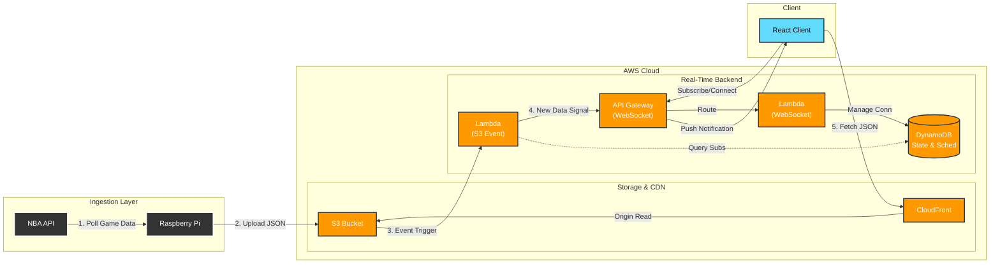

# [CourtVision](https://courtvision.roryeagan.com) 🏀
**Serverless Real-Time NBA Analytics & Play-by-Play Visualization**

   

[ **Launch Live App** ](https://courtvision.roryeagan.com)


## 📖 Introduction
**CourtVision** is a web dashboard for visualizing NBA games with high-density, interactive play-by-play views (beyond a standard scoreboard). I built it because I wanted a specific way to follow games live while watching, and I use it regularly.

The app runs on a **serverless AWS architecture** and uses a **hybrid push/pull real-time pattern**:
- WebSockets notify clients when new data is available.
- Clients then fetch the latest game data through **CloudFront → S3**, benefiting from CDN caching.

## ☁️ Architecture & Data Flow



> **Design goal:** Real-time feel without blasting large payloads through WebSockets. Keep costs low by using CDN caching for data reads and small WebSocket notifications for freshness.

### High-Level Components
- **Frontend:** React (Vite) static app served via **CloudFront** (origin: **S3**).
- **Game data storage:** JSON files in **S3**, served through **CloudFront**.
- **Real-time signaling:** **API Gateway WebSocket API** with **Lambda** handlers.
- **Connection/session state:** **DynamoDB** (stores connection IDs + current subscription info such as game/date).
- **Schedule metadata:** **DynamoDB** table for schedule basics; schedule payload is pushed via WebSockets.
- **Ingestion:** **Raspberry Pi** polls the NBA API and uploads new data to S3.

### 1) Client Subscription Model
Clients “subscribe” to a **game + date**:
- The WebSocket connection is established via API Gateway.
- The backend stores the connection/session in DynamoDB.
- When the user changes game/date, the subscription info updates so notifications can be targeted.

### 2) Data Update Flow (Hybrid Push/Pull)
1. Raspberry Pi polls NBA endpoints and uploads updated JSON to **S3**.
2. **S3 event notification** triggers a **Lambda**.
3. Lambda queries **DynamoDB** (via a GSI keyed by `gameId`) to find connections currently subscribed to that game/date.
4. Lambda sends a **small WebSocket message** like “new data available.”
5. The browser fetches the updated JSON via **CloudFront → S3**.

**Why this pattern?**
- WebSockets stay lightweight (notifications only).
- CDN handles the heavy lifting for reads.
- It scales better than pushing full data payloads through WS as usage grows.

### 3) Schedule Updates
- A DynamoDB table holds basic schedule metadata.
- A Lambda can send the full schedule payload to clients directly via WebSocket (useful for navigation without extra fetches).

### Cost Notes
This setup is intentionally cost-conscious:
- Writes are mainly driven by ingestion frequency (S3 PUTs).
- Reads are mostly CDN-backed.
- With minimal users and tiered polling (favorite team more frequent), the monthly cost can stay extremely low.

## ⚡ Key Features

### 📊 High-Density Visualization
- **Interactive SVG charting** (pure SVG — no Canvas/D3 requirement).
- Hover/tooltip-style inspection of game events and game state.

### 🔌 Real-Time Updates
- WebSocket “data changed” notifications keep the UI feeling live.
- Data is fetched via CloudFront for caching efficiency.

### 🎨 UI/UX
- Dark-mode friendly layout.
- Designed for desktop-first analysis, usable on smaller screens.

## 📂 Repository Structure

The codebase is organized into three distinct logical units:

| Directory | Description |
| :--- | :--- |
| **`front/`** | **Frontend Client.** A Vite + React application. Contains the WebSocket connection manager, visualization components, and global state management logic. |
| **`functions/`** | **Serverless Backend.** AWS Lambda functions written in Node.js. Handles WebSocket lifecycle events (`$connect`, `$disconnect`) and broadcasts updates via API Gateway. |
| **`jobs/`** | **Data Pipeline.** Standalone Node.js workers that poll external NBA APIs, normalize the data, compressed it (GZIP), and upload to S3/DynamoDB. |

## 🛠️ Local Development & Setup

<details>
<summary><strong>Click to expand Setup Instructions</strong></summary>

### Prerequisites
* **Node.js** v18+
* **AWS Credentials** configured (with access to the target S3 Bucket and DynamoDB Tables)

### Installation
1. Clone the repository:
   ```bash
   git clone https://github.com/eaganro/courtvision.git
   ```

2. Install dependencies:
   ```bash
   cd front
   npm install
   ```

3. Configure Environment:
   Create a `.env.local` file in the `front/` directory:
   ```env
   VITE_WS_LOCATION=wss://<your-api-gateway-websocket-endpoint>
   VITE_PREFIX=https://<your-s3-cdn-url>
   ```

4. Run the development server:
   ```bash
   npm run dev
   ```

### Running the Data Pipeline (Manual Trigger)
To seed the database or force an update locally:
```bash
# Fetch full schedule
node jobs/getFullSchedule.js

# Poll for live game data
node jobs/pollingGetData.js
```
</details>

## 🚀 Roadmap / Next Improvements

- **WebSocket resiliency:** automatic reconnect with exponential backoff + heartbeat/ping, plus server-side cleanup of stale connections.
- **TypeScript migration (gradual):** introduce shared types for payloads/models first, then convert components incrementally.
- **Testing:** add a Playwright E2E smoke test (load game, connect WS, render chart) and a small set of unit tests for data transforms/parsing.
- **Ingestion hardening:** better handling for NBA API outages/rate limits, plus alerting/logging around missed updates.
