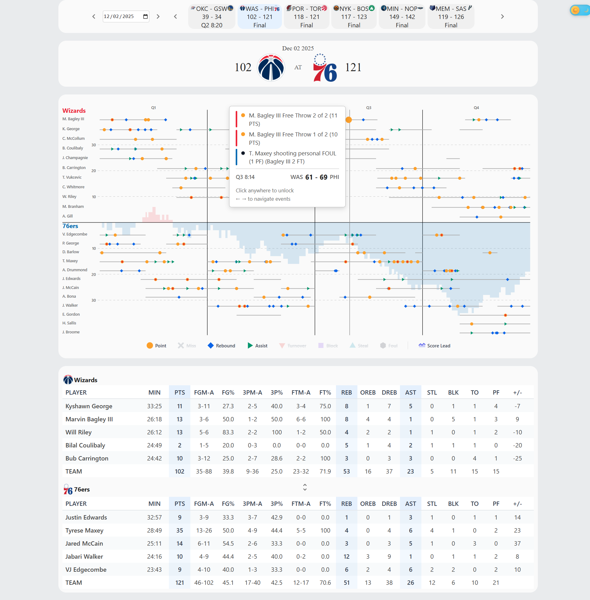
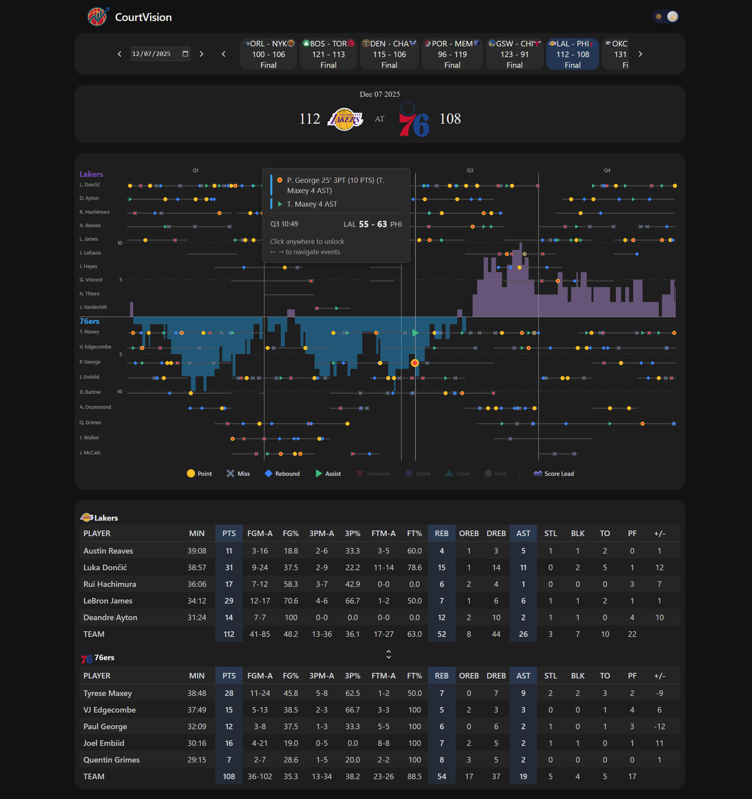

# [nba.roryegan.com](https://nba.roryeagan.com)

NBA game tracker that streams play-by-play, box score, and schedule data into a fast React front end. Use it to scan a day’s games, jump into a matchup, and explore every action on a timeline with player on/off detail.

Light Mode:


Dark Mode:


## Features
- Live data: WebSocket pushes notify the client when fresh play-by-play or box data lands in S3, so the page updates without reloads.
- Schedule-first workflow: pick a date, drag through the day’s games, or deep-link with `?date=YYYY-MM-DD&gameid=...`.
- Timeline explorer: hover or arrow-key through actions, see score deltas, and visualize which players were on the floor.
- Box score summary: condensed team stats with expand/collapse for deeper columns.
- Action filters and preferences: toggle stat types, show/hide score differential, persist choices via `localStorage`.
- Light/dark support and responsive layout tuned for both desktop and phone screens.

## Repo Layout
- `front/` — Vite + React UI (MUI, Emotion, Sass). Uses WebSockets and S3-hosted JSON for data.
- `functions/` — AWS Lambda handlers for WebSocket subscriptions, S3 fan-out, and scoreboard ingest.
- `jobs/` — Node scripts that poll NBA endpoints, gzip uploads to S3, and seed DynamoDB with schedule/results.

## Frontend: Getting Started
Requirements: Node 18+ and npm.

1) Install deps:
```bash
cd front
npm install
```
2) Create `front/.env.local`:
```env
VITE_WS_LOCATION=wss://<your-websocket-endpoint>
VITE_PREFIX=https://roryeagan.com-nba-processed-data.s3.amazonaws.com   # or your CDN/base URL
```
3) Run locally:
```bash
npm run dev
```
4) Production build:
```bash
npm run build
# optional: npm run preview
# optional: npm run build:prod:upload  # syncs dist/ to the S3 bucket used in this project
```

### Useful behavior
- Query params stay in sync; copy the URL to share a specific game/date.
- Selecting a different date automatically subscribes to that date’s schedule feed over the WebSocket.
- When a game ends, the client closes the WS connection after pulling the final box score.

## Data Pipeline (AWS)
High level flow:
- `jobs/pollingGetData.js` polls NBA live endpoints, gzips play-by-play and box JSON into `s3://roryeagan.com-nba-processed-data/data/...`, maintains a manifest, and updates DynamoDB scores/status.
- `jobs/getFullSchedule.js` seeds `NBA_Games` with the full league schedule (ET dates, start times, labels).
- `functions/FetchTodaysScoreboard` runs daily to keep `NBA_Games` current for the day.
- DynamoDB stream -> `functions/gameDateUpdates` publishes the updated daily schedule to WebSocket subscribers of that date (`DateConnections` table, GSI `date-index`).
- S3 event -> `functions/ws-sendGameUpdate-handler` broadcasts `{ key, version }` when new box/play files arrive, so clients refetch.
- WebSocket routes:
  - `functions/ws-joinDate-handler`: record a connection’s date subscription and immediately send that date’s games.
  - `functions/ws-joinGame-handler`: record a connection’s game subscription for live play/box updates.
  - `functions/ws-disconnect-handler`: clean up stale connections.

Key AWS resources expected:
- DynamoDB tables: `NBA_Games` (GSI `ByDate`), `GameConnections`, `DateConnections` (GSI `date-index`).
- S3 bucket: `roryeagan.com-nba-processed-data` (keys under `data/` and `manifest.json`).
- API Gateway WebSocket endpoint exposed as `VITE_WS_LOCATION`.

## Deployment Notes
- Frontend can be served from any static host/CDN; ensure `VITE_PREFIX` points to the bucket/CloudFront URL that serves the gzipped JSON assets and team logos under `/img/teams/`.
- Lambda and job scripts assume AWS credentials with access to the above tables/bucket; run `node jobs/pollingGetData.js` or `node jobs/getFullSchedule.js` with that profile configured.
